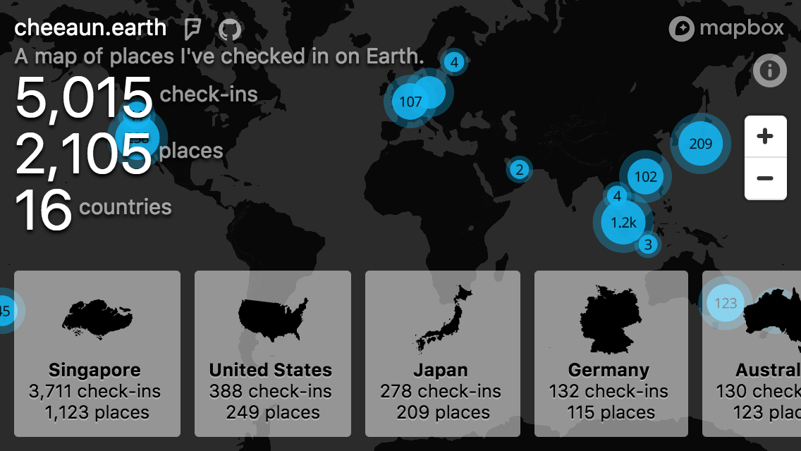

Earth - Places Visited
---

Objective
---

This open source project from Lim Chee Aun demonstrates the use of mapbox, Foursquare and Serve -- operating in concert to present a complex visual experience through a simple server

Get started -
---

1. clone to desktop
2. npm install
3. npm run server
4. point browser to localhost:5000

Related
---

- [Foursquare](https://foursquare.com/)
- [Swarm](https://www.swarmapp.com/)
- [Gyroscope](https://gyrosco.pe/)
- [Dustin Curtis](https://github.com/dcurtis)'s [Conquer Earth](https://conquer.earth/)
- [4sqmap](http://www.4sqmap.com/)
- [Where Do You Go](http://www.wheredoyougo.net/)
- [Your diary (on Foursquare)](http://diary.look4square.com/)

License
---

Data powered by [Foursquare](https://foursquare.com/). Map powered by [Mapbox](https://www.mapbox.com/). Vector maps are from [djaiss/mapsicon](https://github.com/djaiss/mapsicon) and [Sn3b/mapsicon](https://github.com/Sn3b/mapsicon).

*Everything else...*

[MIT](https://cheeaun.mit-license.org/) © [Lim Chee Aun](http://cheeaun.com)
